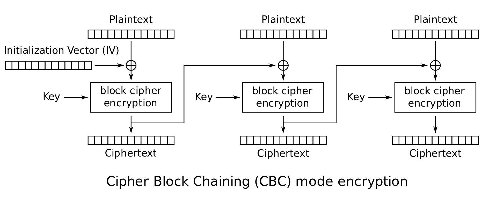
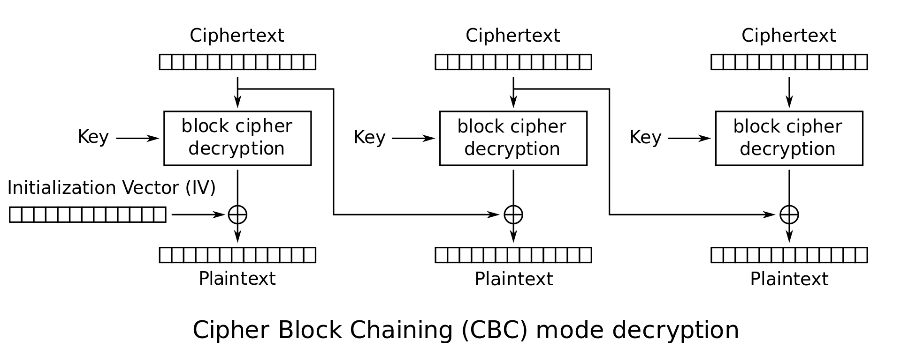

一 什么是CBC模式

CBC模式的全称是Cipher Block Chaining模式（密文分组链接模式），之所以叫这个名字，是因为密文分组像链条一样相互连接在一起。

在CBC模式中，首先将明文分组与前一个密文分组进行XOR运算，然后再进行加密。

CBC模式加解密过程如下：

我们来比较一下ECB模式与CBC模式的区别

ECB模式只进行了加密，而CBC模式则在加密之前进行了一次XOR。

二 初始化向量

当加密第一个明文分组时，由于不存在“前一个密文分组”，因此需要事先准备一个长度为一个分组的比特序列来代替“前一个密文分组”，这个比特序列称为初始化向量（Initialization Vector），通常缩写为IV，一般来说，每次加密时都会随机产生一个不同的比特序列来作为初始化向量。

三 CBC模式的特点

明文分组在加密之前一定会与“前一个密文分组”进行XOR运算，因此即使明文分组1和明文分组2的值是相等的，密文分组1和2的值也不一定是相等的。这样一来，ECB模式的缺陷在CBC模式中就不存在了。

加密过程：在CBC模式中，无法单独对一个中间的明文分组进行加密。例如，如果要生成密文分组3，则至少需要凑齐明文分组1、2、3才行。

解密过程：假设CBC模式加密的密文分组中有一个分组损坏了。在这种情况下，只要密文分组的长度没有发生变化，则解密时最多只有2个分组受到数据损坏的影响。见下图：

假设CBC模式的密文分组中有一些比特缺失了，那么此时即便只缺失1比特，也会导致密文分组的长度发生变化，此后的分组发生错位，这样一来，缺失比特的位置之后的密文分组也就全部无法解密。见下图：

四 对CBC模式的攻击

假设主动攻击者的目的是通过修改密文来操纵解密后的明文。如果攻击者能够对初始化向量中的任意比特进行反转（将1变成0，将0变成1），则明文分组中相应的比特也会被反转。这是因为在CBC模式的解密过程中，第一个明文分组会和初始化向量进行XOR运算。见下图。

但是想对密文分组也进行同样的攻击就非常困难了。例如，如果攻击者将密文分组1中的某个比特进行反转，则明文分组2中相应比特也会被反转，然而这一比特的变化却对解密后的明文分组1中的多个比特造成了影响，也就是说，只让明文分1中所期望的特定比特发生变化是很困难的。

五 填充提示攻击

填充提示攻击是一种利用分组密码中填充部分来进行攻击的方法。在分组密码中，当明文长度不为分组长度的整数倍时，需要在最后一个分组中填充一些数据使其凑满一个分组长度。在填充提示攻击中，攻击者会反复发送一段密文，每次发送时都对填充数据进行少许改变。由于接收者（服务器）在无法正确解密时会返回一个错误消息，攻击者通过这一错误消息就可以获得一部分与明文相关的信息。这一攻击并不仅限于CBC模式，而是适用所有需要进行分组填充的模式。

2014年对SSL3.0 造成了重大影响POODLE攻击实际上就是一种填充示攻击。

六 对初始化向量（IV）进行攻击

初始化向量（IV）必须使用不可预测的随机数。然而在SSL/TLS的TLS1.0版本协议中，IV并没有使用不可预测的随机数，而是使用上一次CBC模式加密时的最后一个分组。为了防御攻击者对此进行攻击，TLS1.1以上的版本中改为了必须显示传送IV。

七 CBC模式应用

确保互联网安全的通信协议之一SSL/TLS，就是使用CBC模式来确保通信机密性的，如使用CBC模式三重DES的3DES_EDE_CBC以及CBC模式256比特AES的AES_256_CBC等。