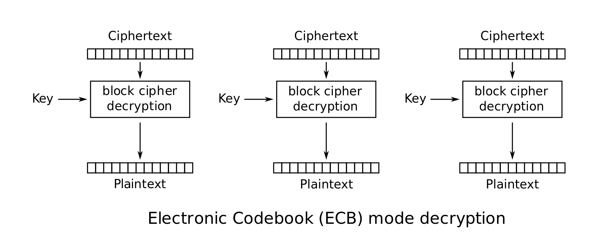

一 什么是ECB模式

ECB模式全称是Electronic CodeBook模式，在ECB模式中，将明文分组加密之后的结果将直接成为密文分组。

使用ECB模式加密时，相同的明文分组会被转换为相同的密文分组，我们可以将其理解为是一个巨大的“明文分组->密文分组”的对应表，因此ECB模式也称为电子密码本模式。

当最后一个明文分组的内容小于分组长度时，需要用一些特定的数据进行填充。

二 ECB模式的特点

ECB模式中，明文分组与密文分组是一一对应的关系，因此，如果明文中存在多个相同的明文分组，则这些明文分组最终都将被转换为相同的密文分组。这样一来，只要观察一下密文，就可以知道明文存在怎样的重复组合，并可以以此为线索来破译密码，因此ECB模式是存在一定风险的。

三 对ECB模式的攻击

攻击者无需破译密码就能操纵明文。

下面举一个例子说明：

假设分组长度为128bit（16个字节），某银行的转账请求数据由以下3个分组构成。

分组1=付款人的银行账号

分组2=收款人的银行账号

分组3=转账金额。

场景是：从A-5374账号向B-6671账号转账1亿元

16进制数据表示如下：

将上面数据用ECB加密，加密后，看不出明文分组内容。

攻击者将密文分组1和2对调。

攻击者没有试图破译密码，但场景却发生了变化：

现在场景变成了：B-6671账号向A-5374账号转账1亿元。

完全相反，这就是ECB的弱点，不破译密文的情况下操纵明文。